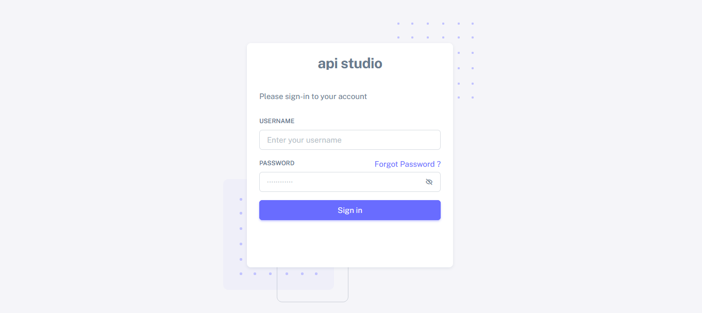
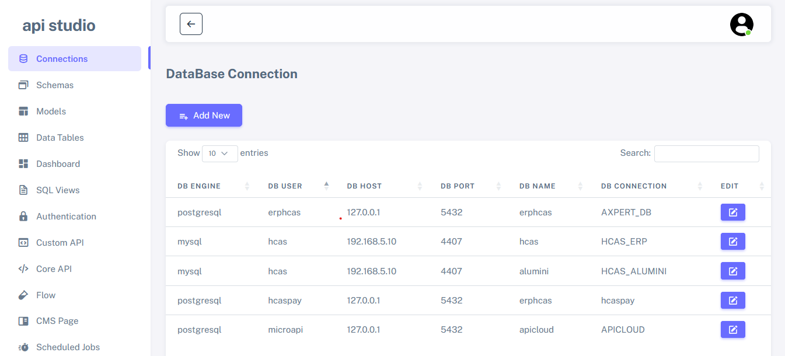
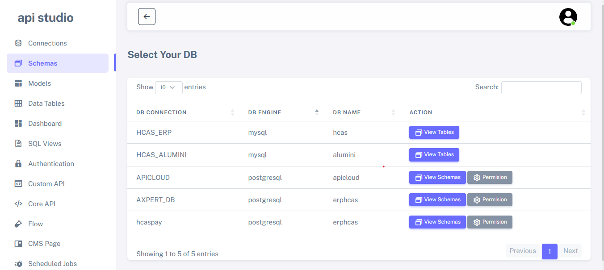
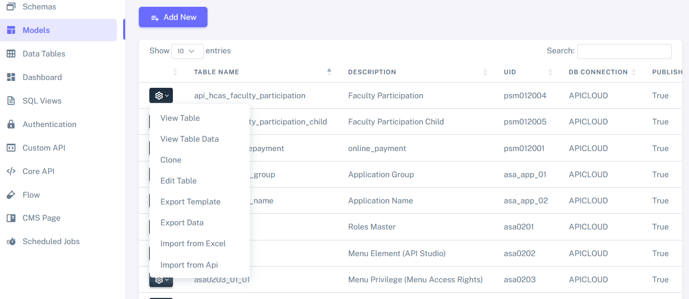
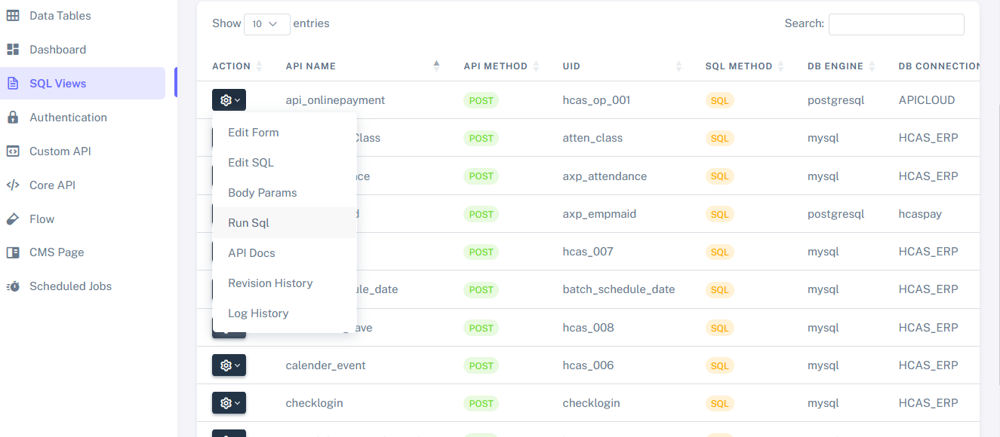
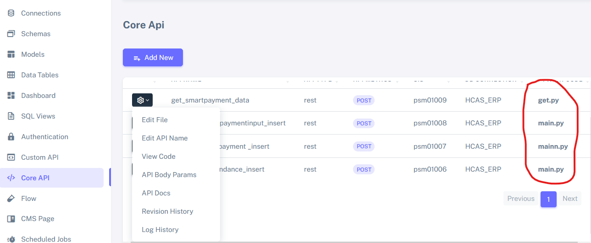
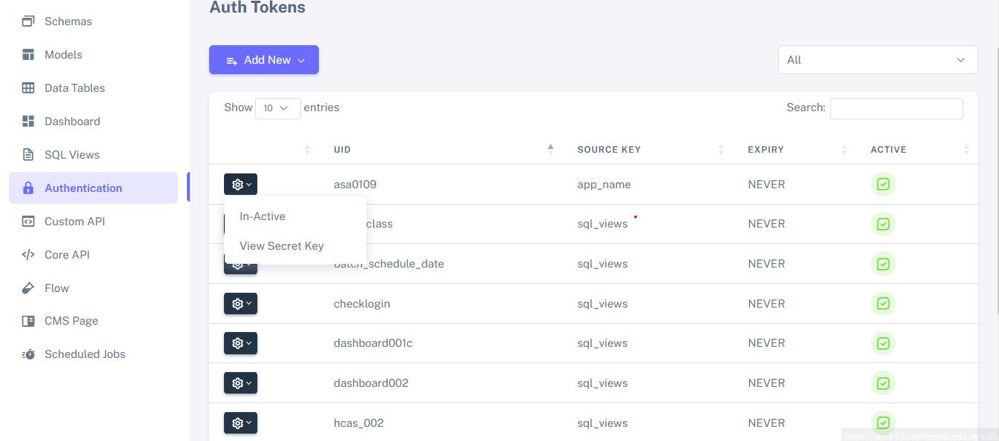
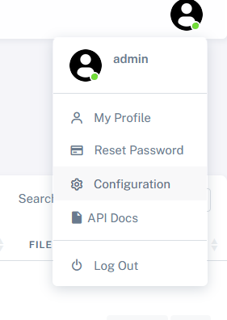
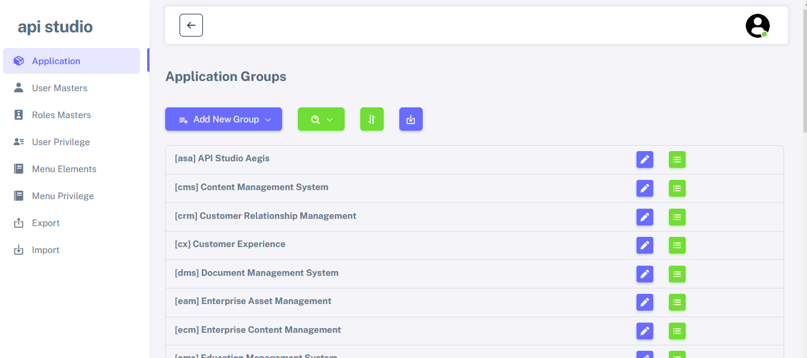

# API STUDIO
Login Page

Database Connection 

Schemas Views

Backend Table Creation with UI and Default CRUD API Published

Developing SQL queries dynamically and publishing APIs in real-time

Implement the business logic in a Python file and upload it after the API is published.

Authenticate all APIs using a secret key and create a corresponding screen.

API Studio Configuration Screen

